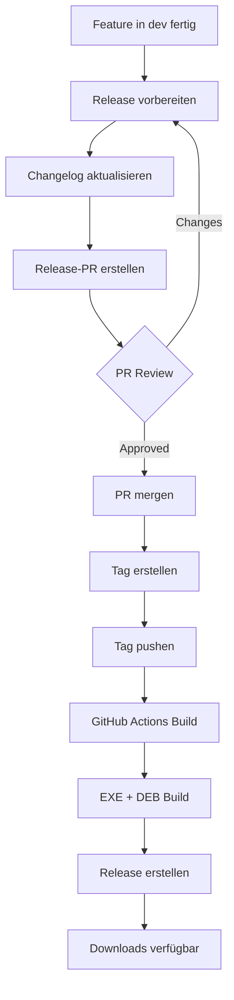

# 🔄 Git Workflow & CI/CD Pipeline

## 📋 Branch-Strategie

### Branches

```
main            ← Produktions-Branch (stabil, released)
  ↑
  └─ dev        ← Entwicklungs-Branch (neueste Features)
       ↑
       ├─ feature/xyz     ← Feature-Entwicklung
       ├─ bugfix/abc      ← Bug-Fixes
       └─ hotfix/123      ← Dringende Fixes
```

### Branch-Beschreibungen

- **`main`**: Stabiler Produktions-Code
  - Nur Merges von `dev` oder `hotfix/*`
  - Jeder Commit ist ein Release
  - Geschützt: Direkte Commits verboten

- **`dev`**: Aktive Entwicklung
  - Features werden hier integriert
  - Basis für neue Features
  - CI/CD läuft automatisch

- **`feature/*`**: Feature-Entwicklung
  - Von `dev` abzweigen
  - Zurück in `dev` mergen
  - Nach Merge löschen

- **`bugfix/*`**: Bug-Fixes
  - Von `dev` abzweigen
  - Zurück in `dev` mergen

- **`hotfix/*`**: Dringende Fixes
  - Von `main` abzweigen
  - In `main` UND `dev` mergen

---

## 🚀 Workflows

### 1. Feature entwickeln

```bash
# 1. Dev-Branch aktualisieren
git checkout dev
git pull origin dev

# 2. Feature-Branch erstellen
git checkout -b feature/mein-feature

# 3. Entwickeln & Committen
git add .
git commit -m "feat: Beschreibung"

# 4. Pushen
git push origin feature/mein-feature

# 5. Pull Request zu dev erstellen
# Auf GitHub: Pull Request öffnen
```

### 2. Bug fixen

```bash
# 1. Bugfix-Branch erstellen
git checkout dev
git checkout -b bugfix/issue-123

# 2. Fix implementieren
git add .
git commit -m "fix: Bug #123 behoben"

# 3. Pushen & PR
git push origin bugfix/issue-123
```

### 3. Hotfix (dringend)

```bash
# 1. Von main abzweigen
git checkout main
git checkout -b hotfix/kritischer-bug

# 2. Fix implementieren
git add .
git commit -m "fix: Kritischer Bug behoben"

# 3. In main mergen
git checkout main
git merge hotfix/kritischer-bug
git push origin main

# 4. Auch in dev mergen
git checkout dev
git merge hotfix/kritischer-bug
git push origin dev

# 5. Hotfix-Branch löschen
git branch -d hotfix/kritischer-bug
```

### 4. Release erstellen

#### Schritt 1: Release vorbereiten

```bash
# 1. Auf dev wechseln
git checkout dev
git pull origin dev

# 2. Changelog aktualisieren
nano docs/CHANGELOG.md
# Füge neue Version hinzu

# 3. Committen
git add docs/CHANGELOG.md
git commit -m "docs: Changelog für v3.1.0"
git push origin dev
```

#### Schritt 2: Release-PR erstellen

**Auf GitHub:**
1. Gehe zu **Actions**
2. Wähle **"Create Release PR"**
3. Klicke **"Run workflow"**
4. Gib Version ein: `3.1.0`
5. Klicke **"Run"**

Dies erstellt automatisch einen PR von `dev` → `main`.

#### Schritt 3: PR reviewen & mergen

1. Review den PR
2. Checke die Checkliste ab
3. Merge den PR

#### Schritt 4: Tag erstellen

```bash
# 1. Main aktualisieren
git checkout main
git pull origin main

# 2. Tag erstellen
git tag -a v3.1.0 -m "Release v3.1.0"

# 3. Tag pushen
git push origin v3.1.0
```

#### Schritt 5: Automatischer Build

GitHub Actions baut automatisch:
- ✅ Windows EXE
- ✅ Linux DEB
- ✅ GitHub Release mit Downloads

---

## 🤖 GitHub Actions Workflows

### 1. `test.yml` - Tests

**Trigger:** Push/PR auf `dev` oder `main`

**Was passiert:**
- ✅ Python 3.12 Setup
- ✅ Dependencies installieren
- ✅ Imports testen
- ✅ Module testen
- ✅ Syntax-Check

**Matrix:** Ubuntu + Windows

### 2. `build-release.yml` - Build & Release

**Trigger:**
- Push auf `dev` (nur Build)
- Tag `v*` (Build + Release)

**Jobs:**

#### Build Windows
1. Checkout Code
2. Python Setup
3. Dependencies installieren
4. PyInstaller Build
5. EXE hochladen

#### Build Linux
1. Checkout Code
2. Python Setup
3. Dependencies installieren
4. PyInstaller Build
5. DEB-Paket erstellen (fpm)
6. DEB hochladen

#### Create Release (nur bei Tag)
1. Downloads von Build-Jobs
2. GitHub Release erstellen
3. EXE & DEB anhängen

### 3. `create-release-pr.yml` - Release PR

**Trigger:** Manuell (workflow_dispatch)

**Parameter:** Version (z.B. 3.1.0)

**Was passiert:**
1. Dev-Branch checken
2. Release-Branch erstellen
3. PR zu main erstellen
4. Checkliste hinzufügen

---

## 📦 Release-Prozess

### Vollständiger Ablauf



### Version-Nummern

Wir folgen **Semantic Versioning**: `MAJOR.MINOR.PATCH`

- `MAJOR` (1.0.0 → 2.0.0): Breaking Changes
- `MINOR` (1.1.0 → 1.2.0): Neue Features (backward compatible)
- `PATCH` (1.1.1 → 1.1.2): Bug-Fixes

**Beispiele:**
- `3.0.0` → Erste vollständige Version mit V3 Features
- `3.1.0` → Neue Features (z.B. Mehrsprachigkeit)
- `3.1.1` → Bug-Fix (z.B. PVGIS-Fehler)

---

## 🛠️ Lokales Development

### Setup

```bash
# Projekt clonen
git clone https://github.com/3ddruck12/GeothermieErdsondentool.git
cd GeothermieErdsondentool

# Dev-Branch auschecken
git checkout dev

# Virtuelle Umgebung
python3 -m venv venv
source venv/bin/activate

# Dependencies
pip install -r requirements.txt

# Entwickeln...
```

### Vor dem Commit

```bash
# 1. Formatierung checken
python -m py_compile main.py

# 2. Module testen
python -m calculations.thermal
python -m data.soil_types

# 3. GUI testen
python main.py

# 4. Commit
git add .
git commit -m "feat: Neue Funktion"
```

### Build lokal testen

```bash
# PyInstaller installieren
pip install pyinstaller

# Windows
pyinstaller geothermie.spec

# Testen
dist/GeothermieErdsondentool.exe  # Windows
dist/geothermie-erdsondentool     # Linux
```

---

## 📊 Monitoring

### GitHub Actions Status

Status der Workflows:

[](https://github.com/3ddruck12/GeothermieErdsondentool/actions?query=workflow%3ATests)

[](https://github.com/3ddruck12/GeothermieErdsondentool/actions?query=workflow%3A%22Build+and+Release%22)

### Logs ansehen

1. Gehe zu **Actions** Tab
2. Wähle Workflow
3. Klicke auf Run
4. Expandiere Steps

---

## 🔒 Branch Protection Rules

### `main` Branch

- ✅ Require PR before merging
- ✅ Require status checks to pass
  - `test (ubuntu-latest)`
  - `test (windows-latest)`
- ✅ Require review from code owner
- ✅ Dismiss stale reviews
- ✅ Require linear history
- ❌ Allow force pushes
- ❌ Allow deletions

### `dev` Branch

- ✅ Require PR before merging
- ✅ Require status checks to pass
  - `test (ubuntu-latest)`
  - `test (windows-latest)`
- ❌ Require review (optional)
- ❌ Allow force pushes

---

## 📚 Weitere Ressourcen

- [Git Flow](https://nvie.com/posts/a-successful-git-branching-model/)
- [Semantic Versioning](https://semver.org/)
- [Conventional Commits](https://www.conventionalcommits.org/)
- [GitHub Actions Docs](https://docs.github.com/en/actions)

---

## 🆘 Troubleshooting

### Build schlägt fehl

```bash
# Lokalen Build testen
pip install pyinstaller
pyinstaller geothermie.spec

# Logs checken
cat build/geothermie/warn-geothermie.txt
```

### Tests schlagen fehl

```bash
# Einzelne Module testen
python -m calculations.thermal
python -m data.soil_types

# Dependencies checken
pip list
```

### Merge-Konflikte

```bash
# Dev in Feature mergen
git checkout feature/xyz
git merge dev

# Konflikte auflösen
git add .
git commit -m "merge: Konflikte aufgelöst"
```

---

**Bei Fragen: [GitHub Issues](https://github.com/3ddruck12/GeothermieErdsondentool/issues) öffnen**


